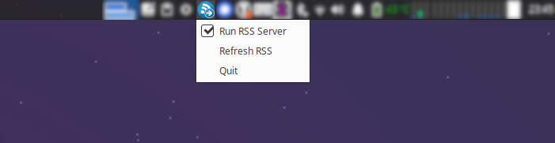

# rss-forward

Application provides RSS channel for content scraped from web pages.
Web pages could require authentication and that do not discourage us from receiving desired information.
Moreover, by using supported KeePassXC it is simple to mimic *Single Sign-On* authentication to many servces.

RSS provided by the application can be used for example in *Thunderbird* or other feed reader.

Main motivation to create this project was discouragement towards web services that do not provide any kinds of
notifications forcing users to repetitive login and check for new information.


## Running

[There](doc/cmdargs.md) is description of command line arguments.
To run application simply execute `startrssforward.py` script with config file as follows:
```
startrssforward.py -c <apth-to-config.toml>
```

Application can operate in two modes:
- pure command-line
- in system tray with basic control options as shown below

[](doc/sys-tray-example.png)

Then depending on operation mode RSS data can be imported to any feed reader using file directly or URL, e.g:
- `file:///<path-to-data-root>/<site-id>/<feed-file>` 
- `http://<server-address>/<site-id>/<feed-file>`

where `<path-to-data-root>` is configurable in config file, `<site-id>` and 
`<feed-file>` are defined for each `RSSGenerator` (web-scraper) and `<server-address>` is IP or hostname of machine with 
running application.

If use case is to just grab and store data then execute following:
```
startrssforward.py -c <apth-to-config.toml> --trayicon=False --startserver=False --genloop=False
```

If executed in tray, then state of application will be indicated by following icons:
-  meaning indicating undergoing data fetch or problem with generator
-  meaning RSS server disabled, generation completed
-  meaning RSS server enabled, generation completed


## Config file

There is [example configuration file](examples/config_example.toml) in examples. It has following content:

<!-- insertstart include="examples/config_example.toml" pre="\n\n```\n" post="\n```\n\n" -->

```
#
# example of configuration file
#

[general]
trayicon = true             # enable or disable tray icon
genloop = true              # enable or disable RSS generation loop (if set to 'false' then generation will be triggered only once)
startupdelay = 0            # set delay in seconds before first generation (useful on startup to wait for KeePassXC to start before) 
startserver = true          # set 'false' to prevent starting RSS server (just store data to local files), default: true
port = 8080                 # RSS feed port, default 8080
refreshtime = 3600          # time in seconds between consecutive RSS generator loop iterations, default 3600
dataroot = "data"           # path to store data; path absolute or relative to config directory
                            # default value is app dir inside user home directory
logdir = "log"              # path to store logs; path absolute or relative to config directory
                            # default value is app dir inside user home directory
logviewer = "mousepad %s"   # command line to view log file, %s will be replaced with log path

[[item]]
generator = "librus"
enabled = true                      # enable or disable scraper
auth.type = "RAW"                   # authenticate by providing unencrypted user and password
auth.user = "12345678"              # login example (librus id)
auth.pass = "user_secret"           # password example

[[item]]
generator = "earlystage"
enabled = true                                              # enable or disable scraper
auth.type = "KEEPASSXC"                                     # authenticate by accessing keepassxc deamon
auth.itemurl = "https://online.earlystage.pl/logowanie/"    # URL of keepassxc item (proper user/pass is identified by the URL)

[[item]]
generator = "youtube"
enabled = true
params.url = "https://www.youtube.com/@YouTube/videos"      # YT content link
params.itemsperfetch = 20                                   # how many items to fetch during each generation
params.outfile = "the-yt-videos.xml"                        # output subpath with RSS content

[[item]]
generator = "justjoinit"
enabled = true
[[item.params.filter]]
label = "Offers C++ Warsaw"
url = "https://api.justjoin.it/v2/user-panel/offers?categories[]=9&city=Warszawa&page=1&sortBy=newest&orderBy=DESC&perPage=100&salaryCurrencies=PLN"
itemsperfetch = 20
outfile = "c_warsaw.xml"

[[item]]
generator = "bulldogjob"
enabled = true
[[item.params.filter]]
label = "Offers Python Warsaw"
url = "https://bulldogjob.pl/companies/jobs/s/city,Warszawa/skills,Python/order,published,desc"
itemsperfetch = 20
outfile = "python_warsaw.xml"

[[item]]
generator = "theprotocol"
enabled = true
[[item.params.filter]]
label = "Offers C++ Warsaw"
url = "https://theprotocol.it/filtry/c++;t/warszawa;wp?sort=date?sort=date"
itemsperfetch = 20
outfile = "c_warsaw.xml"

[[item]]
generator = "pracujpl"
enabled = true
[[item.params.filter]]
label = "Offers C++ Warsaw"
url = "https://it.pracuj.pl/praca/warszawa;wp?sc=0&itth=41"
itemsperfetch = 20
outfile = "c_warsaw.xml"

```

<!-- insertend -->

Fields are quite self-descriptive. There are two possible methods of authentication:
- raw data stored inside the file
- KeePassXC deamon.

For KeePassXC there is `itemurl` field identifying item in the database.

Moreover application can be executed without RSS server (`startserver = false`) or detached from system tray (`trayicon = true`).

Some fields are common for config file and command-line arguments. In such cases command-line version has precedence 
over values in the file (overrides values taken from config file).


## Security concerns

There are some conserns to consider:
- in case of `RAW` authentication method credentials will be stored in local harddrive as plain text (user still can
 place config file in encrypted/secure drive)
- in case of `KEEPASSXC` authentication access token to *KeePassXC* will be stored in plain text (*KeePassXC* still
 asks for password for database unlock - *rss-forward* does not prompt or have access to the password)
- username/password or access token to external service will be stored in *RAM* memory
- extracted data in form of RSS feed will be stored in local harddrive in form of plain text
- for log preview app executes in shell command taken in form of string form config file - this can lead to *OS* injection  
- application uses `http.server` library for listeninig on TCP port for incoming connections and as it states in
 library's [documentation](https://docs.python.org/3/library/http.server.html) (service can be disabled):
```
Warning: http.server is not recommended for production. It only implements basic security checks. 
```


## How can I prepare new scraper?

Every webpage is different and uses different authentication protocol. Simple way is to use *Web Developer Tools*
(*Network Monitor*) with *Firefox* or *Chrome* and look for endpoints and authentication steps. Moreover every 
request can be exported as *cURL* request.
There can be problem if website requires *JavaScript* to operate. To determine is *JS* is required to authenticate or
scrap data execute earlier mentioned *cURL* requests (in command line). If they succees then it means that JS is not
required and just `requests` library can be used.


## How to add new generator/scraper?

It's quite easy. Just put scraper module inside `rssforward.site` package. The module have to contain free function
`get_generator()` returning instance/object of the scraper. Moreover scraper class have to inherit from `RSSGenerator`
class. Then comes difficult part: implementation of the scraper.

There is `earlystageapi.py` demostrating how to access restricted data using `requests`.

During generation of RSS it's highly recomended to set `id`/`Message-Id` of items, because *Thunderbird* in case of 
missing identificator concatenates title and beginning of body of message, so it can lead to loss of new messages 
(because of collision of ids). One can use hash of raw data to generate identifier.


## Similar projects

- [web_scraping_example](https://github.com/mattdood/web_scraping_example)
- [rss-proxy](https://github.com/damoeb/rss-proxy)
- [rss-bridge](https://github.com/RSS-Bridge/rss-bridge)
- [feedbridge](https://github.com/dewey/feedbridge)


## References

- [Building an RSS feed scraper with Python](https://codeburst.io/building-an-rss-feed-scraper-with-python-73715ca06e1f)
- [How to build a RSS from scraping using Python](https://medium.com/@pescadordigital/how-to-build-a-rss-from-scraping-using-python-a8ba798aac84)
- [keepassxc-browser](https://github.com/hrehfeld/python-keepassxc-browser)
- [librus-apix](https://github.com/RustySnek/librus-apix)
- [pystray](https://github.com/moses-palmer/pystray)


## License

BSD 3-Clause License

Copyright (c) 2023, Arkadiusz Netczuk <dev.arnet@gmail.com>

Redistribution and use in source and binary forms, with or without
modification, are permitted provided that the following conditions are met:

1. Redistributions of source code must retain the above copyright notice, this
   list of conditions and the following disclaimer.

2. Redistributions in binary form must reproduce the above copyright notice,
   this list of conditions and the following disclaimer in the documentation
   and/or other materials provided with the distribution.

3. Neither the name of the copyright holder nor the names of its
   contributors may be used to endorse or promote products derived from
   this software without specific prior written permission.

THIS SOFTWARE IS PROVIDED BY THE COPYRIGHT HOLDERS AND CONTRIBUTORS "AS IS"
AND ANY EXPRESS OR IMPLIED WARRANTIES, INCLUDING, BUT NOT LIMITED TO, THE
IMPLIED WARRANTIES OF MERCHANTABILITY AND FITNESS FOR A PARTICULAR PURPOSE ARE
DISCLAIMED. IN NO EVENT SHALL THE COPYRIGHT HOLDER OR CONTRIBUTORS BE LIABLE
FOR ANY DIRECT, INDIRECT, INCIDENTAL, SPECIAL, EXEMPLARY, OR CONSEQUENTIAL
DAMAGES (INCLUDING, BUT NOT LIMITED TO, PROCUREMENT OF SUBSTITUTE GOODS OR
SERVICES; LOSS OF USE, DATA, OR PROFITS; OR BUSINESS INTERRUPTION) HOWEVER
CAUSED AND ON ANY THEORY OF LIABILITY, WHETHER IN CONTRACT, STRICT LIABILITY,
OR TORT (INCLUDING NEGLIGENCE OR OTHERWISE) ARISING IN ANY WAY OUT OF THE USE
OF THIS SOFTWARE, EVEN IF ADVISED OF THE POSSIBILITY OF SUCH DAMAGE.


## Icons License

Icons are downloaded from [https://dryicons.com](https://dryicons.com) under following license:

> Terms of Use:
> - Requires Author Attribution
> - Allowed Commercial Use
> - Allowed Personal and Educational Use

and

> In order to use this file you must credit the author with the a link back to this page
> Click to copy the code, then paste it on your website.

Blue icon: <a href='https://dryicons.com/icon/rss-forward-2771'> Icon by Dryicons </a>

Red icon: <a href='https://dryicons.com/icon/rss-forward-494'> Icon by Dryicons </a>

Grey icon is grayscale of following icon: <a href='https://dryicons.com/icon/rss-2882'> Icon by Dryicons </a>
